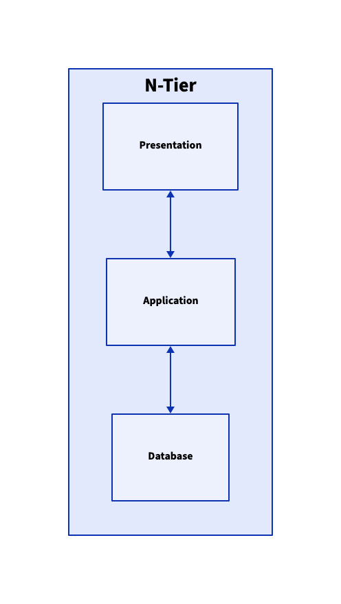
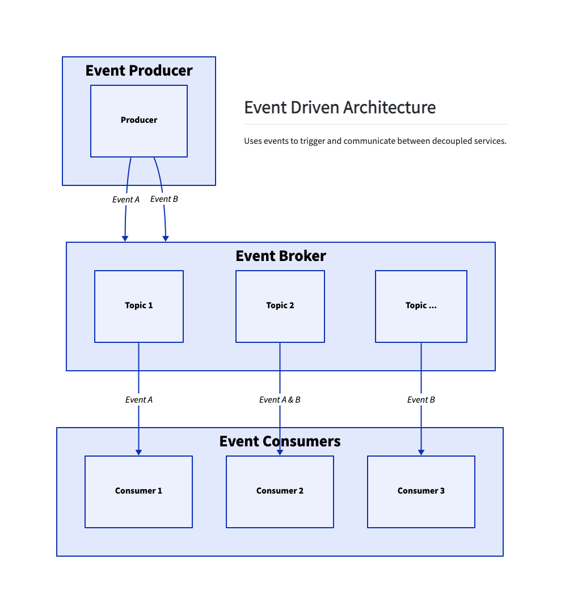

# Architecture Styles
Some architecture style diagrams using [d2](https://github.com/terrastruct/d2)

Run watch of one file
`$ d2 --watch=true [file].d2 [file].svg/.png`

## N-Tier
Generated with: `$ d2 n-tier.d2 n-tier.png`

## Event Driven
Generated with: `$ d2 event-driven.d2 event-driven.png`
